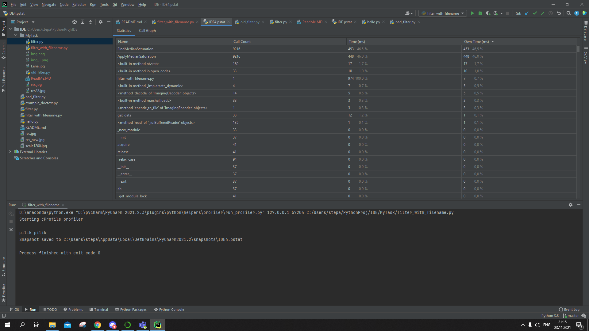
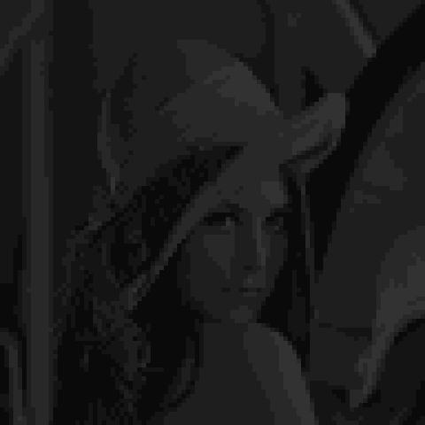
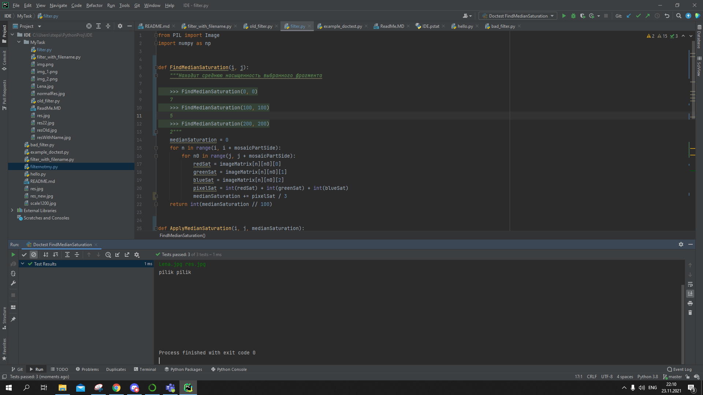
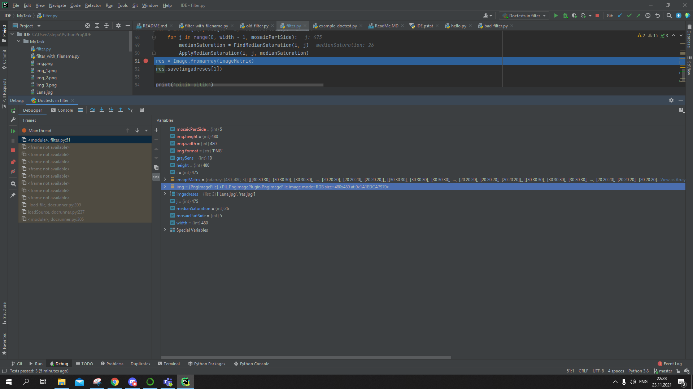

время выполнения нового кода

время выполнения старого кода

Так происходит из-за того, что время, которое пользователь потратил на заполнение данных, тоже считается в общем итоге.

Если дать программе все данные без ввода, то затреченное время значительно уменьшится.
Оригинальное изображение:

Изображение, полученное фильтром со вводом:

Изображение, полученное старым фильтром:

Изображение, полученное фильтром без ввода:

Функция проходит созданные док-тесты

В меню отладчика сверху все необходимые переменные
