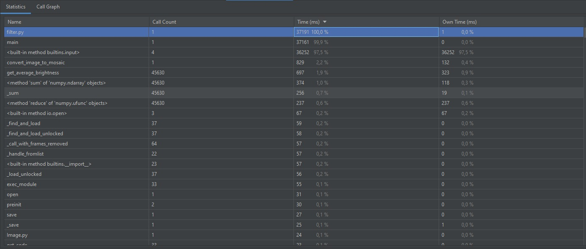
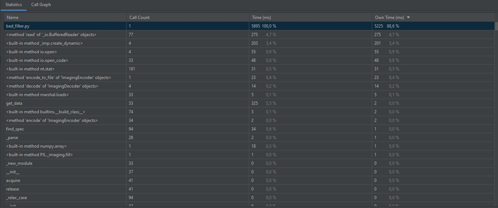
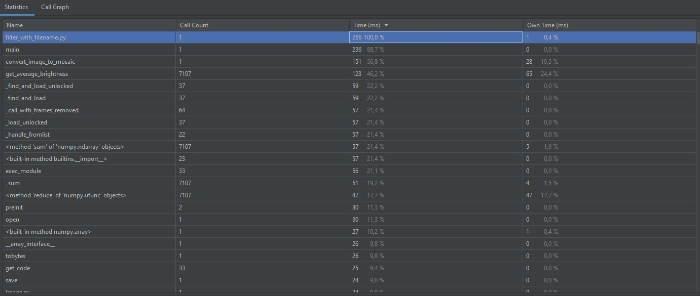
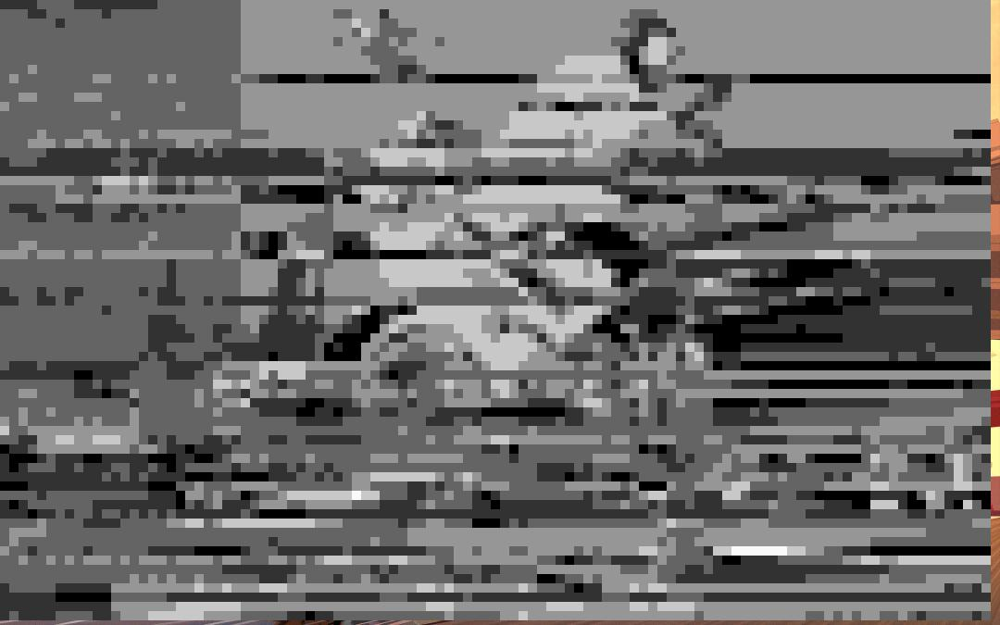
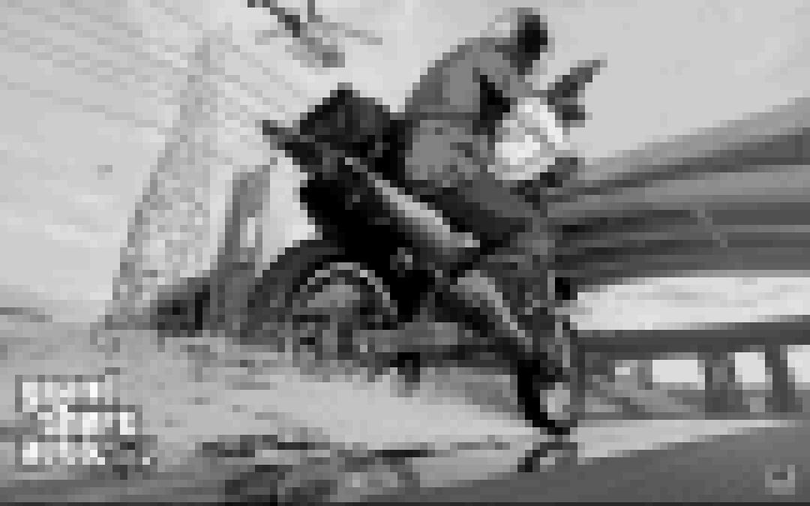
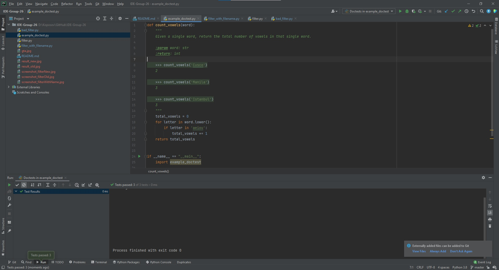
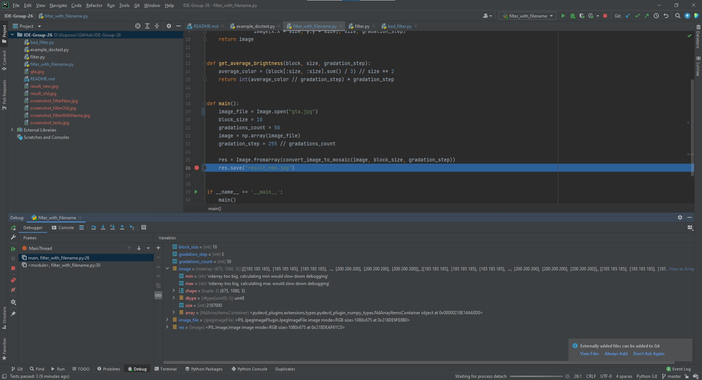

# Копосов Алексей

**Скриншот со временем выполнения `filter.py`:**   

**Скриншот со временем выполнения `old_filter.py`:**   

Время выполнения `filter.py` больше из-за того, что время, которое пользователь потратил на заполнение данных, тоже считается в общем итоге.

**Скриншот со временем выполнения `filter_with_filename.py`:**   

Если дать программе все данные без ввода, то затраченное время значительно уменьшится.

**Оригинальная картинка:**   

**Картинка, преобразованная старым фильтром:**   

**Картинка, преобразованная новым фильтром:**   

**Все doc-тесты выполнены успешно:**   

**Результат работы отладчика:**   

