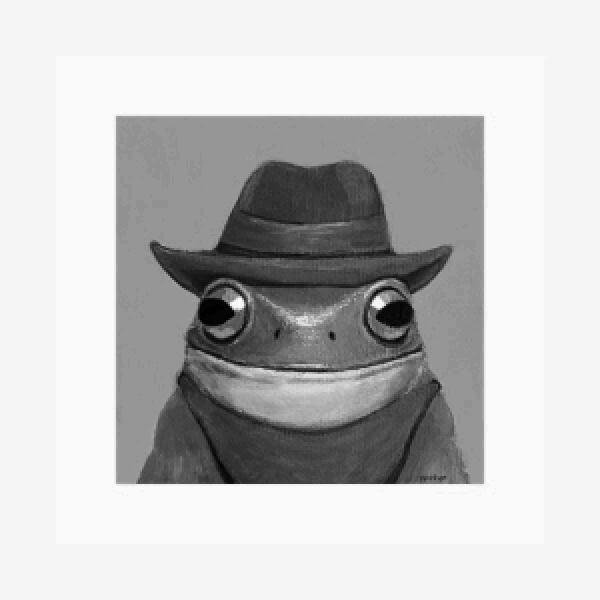
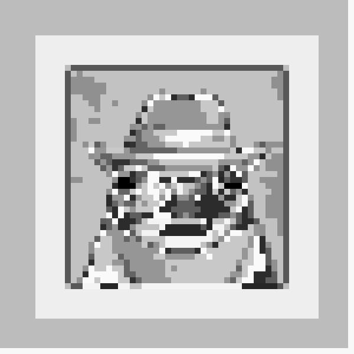

1) Изображение полученное при работе фильтра с вводом и время, затраченное на его работу:

2) Изображение полученное при работе старого фильтра и время, затраченное на его работу:

(Файл filter.py работает медленнее чем old_filter.py, потому что некоторая часть времени тратится на ввод данных)
3) Изображение полученное при работе фильтра без ввода и время, затраченное на его работу:

4) Работа доктестов

5) Ширина, высота и тип изображения

6) Ширина блока и количество градаций серого
