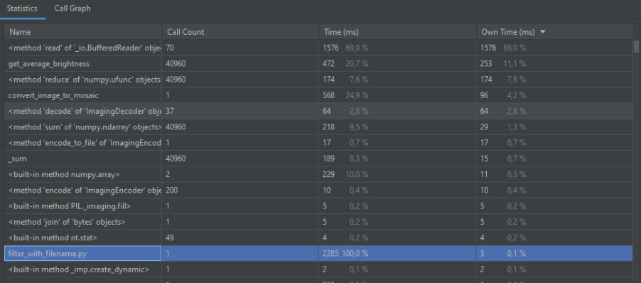
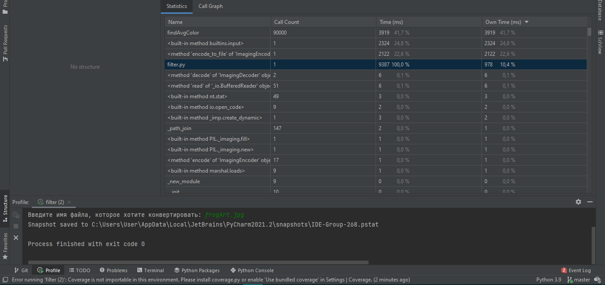
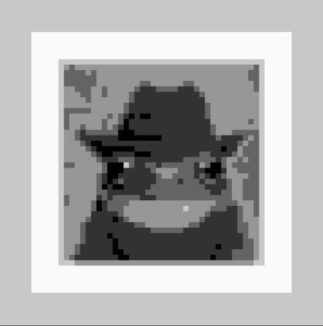

# Refactoring-Group26
## Время выполнения файлов
Исходный файл:

1. Анализ filter.py с помощью встроенного профилизатора и результирующее изображение 

2. Результат анализа bad_filter.py с помощью встроенного профилизатора 

Обработчик сработал быстрее, разница во времени вызвана тем, что в новом варианте фильтра большая часть времени выполнения затрачивается на ввод данных пользователем.

3. Анализ filter_with_filename.py с помощью встроенного профилизатора

Сильное уменьшение времени работы файла вызвано тем, что данные не вводятся пользователем.

